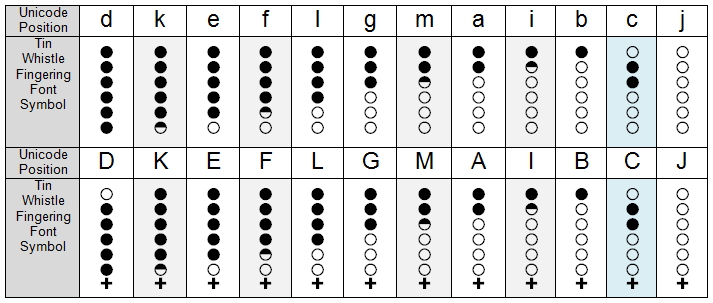

# Tin Whistle Fingering Font

This font resources are related to playing tin whistle or penny whistle.

Objective of the __Tin Whistle Fingering Font__ is to ease score annotation for whistle players.
It is targeting the use of a whistle in the natural scale of D major.
Mind that typically on a whistle in key of D major any scores of key of G major can be played as well.

# How to read the intended font annotation

The supported fingering annotation in the Tin Whistle Fingering Font is used in following scores.

Each fingering annotation below the score note to be played show the six holes of the whistle tuned as D major. A black filled hole represents a whistle hole covered by a finger and an unfilled circle represents an open uncovered whistle hole. The upper three whistle holes are usually played with the left hand (index finger, middle finger, ring finger). The lower three holes are usually played with the right hand (index finger, middle finger, ring finger). A 'plus' sign below the fingering hole annotation indicates that blowing a higher note has to be achieved. This is performed by blowing a bit harder into the whistle.

To hear an audio sample of this score you can play back the file <a href="https://raw.githubusercontent.com/OMerkel/tin_whistle/master/res/font/The_Tin_Whistle_-_Key_of_D.ogg">The_Tin_Whistle_-_Key_of_D.ogg</a>. If this sounds a bit like you playing the notes on your whistle then you are on the right way.

Switching into notation of the key of G major there is a difference in the representation of any c# and c note in score writing. As in scale of D major playing all holes uncovered will produce a c# when blowing the whistle. The corresponding unmodified note without accidental '#' (sharp) in G major has a different pitch and uses a different fingering annotation as shown with middle finger and ring finger of upper hand (left hand) covering their whistle holes. 

To hear an audio sample of this score you can play back the file <a href="https://raw.githubusercontent.com/OMerkel/tin_whistle/master/res/font/The_Tin_Whistle_-_In_Scale_of_G.ogg">The_Tin_Whistle_-_In_Scale_of_G.ogg</a>. If this sounds a bit like you playing the notes on your whistle then you are on the right way.

# Font structure

<table border="1">
<tbody>
<tr>
<td>Register</td>
<td colspan="12">Low register</td>
<td colspan="12">High register</td>
</tr>
<tr>
<td>Tone</td>
<td>D4</td><td><b>D#4</b></td><td>E4</td><td><b>F4</b></td><td>F#4</td>
<td>G4</td><td><b>G#4</b></td><td>A4</td><td><b>A#4</b></td>
<td>B4</td><td>C5</td><td>C#5</td>

<td>D5</td><td><b>D#5</b></td><td>E5</td><td><b>F5</b></td><td>F#5</td>
<td>G5</td><td><b>G#5</b></td><td>A5</td><td><b>A#5</b></td>
<td>B5</td><td>C6</td><td>C#6</td>
</tr>
<tr>
<td>Frequency (Hz)</td>
<td>294</td>
<td>311</td>
<td>330</td>
<td>349</td>
<td>370</td>
<td>392</td>
<td>415</td>
<td>440</td>
<td>466</td>
<td>494</td>
<td>523</td>
<td>554</td>

<td>587</td>
<td>622</td>
<td>659</td>
<td>698</td>
<td>740</td>
<td>784</td>
<td>831</td>
<td>880</td>
<td>932</td>
<td>988</td>
<td>1047</td>
<td>1109</td>
</tr>
<tr>
<td>Scale</td>
<td colspan="10">Scale 4</td>
<td colspan="12">Scale 5</td>
<td colspan="2">Scale 6</td>
</tr>
<tr>
<td>SVG Font Glyph Name</td>
<td>d</td>
<td>d-sharp</td>
<td>e</td>
<td>f</td>
<td>f-sharp</td>
<td>g</td>
<td>g-sharp</td>
<td>a</td>
<td>a-sharp</td>
<td>b</td>
<td>c</td>
<td>c-sharp</td>

<td>D</td>
<td>D-sharp</td>
<td>E</td>
<td>F</td>
<td>F-sharp</td>
<td>G</td>
<td>G-sharp</td>
<td>A</td>
<td>A-sharp</td>
<td>B</td>
<td>C</td>
<td>C-sharp</td>
</tr>
<tr>
<td>Font Unicode Character</td>
<td>d</td>
<td>k</td>
<td>e</td>
<td>f</td>
<td>l</td>
<td>g</td>
<td>m</td>
<td>a</td>
<td>i</td>
<td>b</td>
<td>c</td>
<td>j</td>

<td>D</td>
<td>K</td>
<td>E</td>
<td>F</td>
<td>L</td>
<td>G</td>
<td>M</td>
<td>A</td>
<td>I</td>
<td>B</td>
<td>C</td>
<td>J</td>
</tr>
<tr>
<td>Musescore note.pitch</td>
<td>62</td><td>63</td><td>64</td><td>65</td><td>66</td><td>67</td>
<td>68</td><td>69</td><td>70</td><td>71</td><td>72</td><td>73</td>

<td>74</td><td>75</td><td>76</td><td>77</td><td>78</td><td>79</td>
<td>80</td><td>81</td><td>82</td><td>83</td><td>84</td><td>85</td>
</tr>
</tbody>
</table>

The Musescore note.pitch follow the MIDI note numbers ( 60 being mapped onto c4 ).

The tone frequency is fm =  2(m−69)/12&#183;(440 Hz) with m being the MIDI note number.

# Not supported yet...

* Uncommon alternative fingering annotations (for same or rarely played notes) are unsupported currently.
* Annotations beyond whistle hole covering, e.g. for tongueing, slurring, sliding, cutting, trills or vibrato techniques are unsupported currently.

# Legal

Logos and trademarks belong to their respective owners.

Copyright (c) 2015 Oliver Merkel

If not otherwise stated this work including all fonts, glyphs, and graphics
(independent of its format) is licensed under a
  
 
<a rel="license" href="http://creativecommons.org/licenses/by-nc-sa/4.0/">
Creative Commons Attribution-NonCommercial-ShareAlike 4.0 International License</a>.
